## Introduction: The AI Integration Revolution

Monday morning, 9:00 AM. The boardroom at GlobalBank fills with nervous energy as the CTO presents a demo that will either transform the company's customer service or become another failed AI initiative.

"Watch this," Sarah, the Chief Technology Officer, says as she types into a simple chat interface: "What's my account balance and how has Bitcoin performed this week?"

Within seconds, the response appears: "Your checking account balance is $3,247.50. Bitcoin has gained 12% this week, currently trading at $67,400."

The room erupts in excited murmurs. The customer service VP leans forward: "This could revolutionize our call center operations. How quickly can we deploy this to production?"

Sarah's expression shifts. "Well, that's... where things get complicated."

This moment, the gap between AI demonstration and enterprise deployment, is where most organizations find themselves today. The technology works beautifully in controlled environments, but the journey to production-ready, enterprise-grade AI integration reveals a labyrinth of challenges that can derail even the most promising initiatives.

This article chronicles that journey: from the initial excitement of Model Context Protocol (MCP) implementation to building a bulletproof enterprise architecture that meets banking-grade requirements for security, compliance, and operational resilience.

## Part 1: Understanding the MCP Foundation

### The Promise of Model Context Protocol

Three weeks earlier, in GlobalBank's innovation lab...

Model Context Protocol represents a breakthrough in enterprise AI integration. Instead of building custom connections for every AI tool and service, MCP provides a standardized framework that allows Large Language Models to seamlessly discover, understand, and execute functions across your entire enterprise ecosystem.

Think of MCP as the universal translator for enterprise AI, enabling your LLM to naturally interact with customer databases, market data feeds, transaction systems, and business applications as if they were all speaking the same language.

### The Simple Magic: How MCP Works

When a client application needs to access account balance and Bitcoin price data, something remarkable happens behind the scenes:

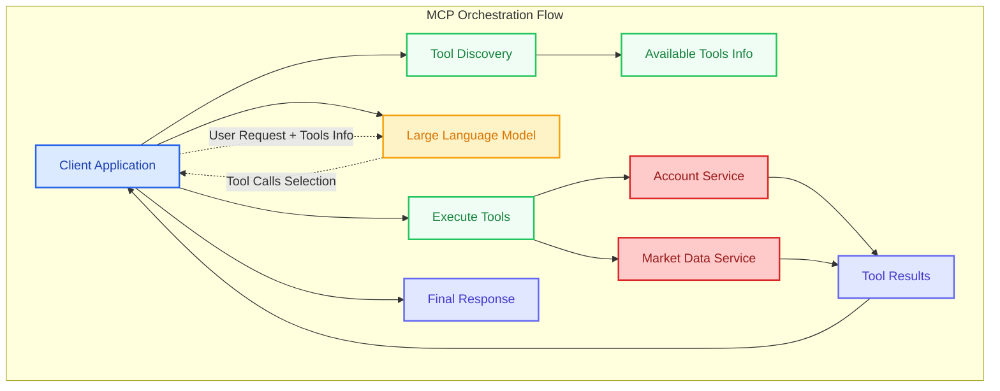

The beauty lies in its simplicity:

1. Tool Discovery: The client application discovers available enterprise tools via MCP
2. LLM Consultation: Client sends user request plus available tools to the LLM for intelligent selection
3. Tool Execution: Client executes the LLM-selected tool calls via MCP
4. Response Assembly: Tool results are collected and formatted into a unified response

### The Initial Success

GlobalBank's pilot deployment was nothing short of impressive. Customer service representatives could handle complex queries in seconds instead of minutes. Account information, transaction history, market data, and regulatory reports, all accessible through natural conversation.

The early architectural patterns were compelling:

- Significantly faster query resolution compared to traditional menu-driven systems
- High accuracy for complex multi-tool requests through intelligent routing
- Strong user adoption with positive satisfaction feedback

But as the excitement built around expanding beyond the pilot, the enterprise realities began to surface.

"We've built something amazing," Sarah told her team after the third week of successful pilots. "Now we need to make it bulletproof."

## Part 2: The Enterprise Reality Check

### When Simple Becomes Complex

The following Monday, Sarah's confidence faced its first real test.

The pilot had been running smoothly with 50 customer service representatives accessing basic account information. But scaling to 2,000 representatives across 12 business units revealed cracks in the foundation that no one had anticipated.

The incident report from that morning painted a sobering picture:

8:47 AM: Customer service representative accidentally accessed sensitive trading data meant only for investment advisors

9:23 AM: System crashed when 200 simultaneous requests overwhelmed the Bitcoin price service

10:15 AM: Compliance team flagged 47 data access violations with no audit trail

11:30 AM: Three separate MCP services failed, bringing down customer account access completely

Sarah stared at the incident timeline, realizing that their "simple" MCP implementation had six critical enterprise problems hidden beneath its elegant surface.

### 🚨 The Six Enterprise Nightmares

#### Problem 1: The Security Vacuum

"Any application can access any tool, anytime, anywhere."

The pilot had no authentication layer between applications and MCP tools. A customer service application could accidentally invoke high-privilege trading operations, access executive data feeds, or trigger confidential regulatory reports. In an enterprise environment, this isn't just a bug, it's a regulatory catastrophe waiting to happen.

The Domino Effect: When the customer service application requested "account activity" data, it inadvertently accessed executive trading tools instead of customer account tools. The system had no way to distinguish application permissions, tool classifications, or access boundaries between different client applications.

#### Problem 2: The Validation Void

"Garbage in, chaos out."

Without proper validation, the LLM could generate tool calls with invalid parameters, malformed requests, or nonsensical combinations. One representative's query about "tomorrow's yesterday's bitcoin price" crashed the market data service for 20 minutes.

The Cascade Failure: Invalid requests didn't just fail gracefully, they propagated errors through multiple systems, creating a domino effect that required manual intervention to resolve.

#### Problem 3: The Resource Efficiency Trap

"Every question requires full LLM processing, even when you've asked it 100 times today."

With no caching mechanism, identical queries repeatedly hit LLM APIs with no optimization. The question "What's the current exchange rate for EUR to USD?" was processed hundreds of times in one morning, generating massive unnecessary resource consumption.

The Scalability Problem: As usage scaled, the resource utilization became unsustainable. Simple account balance checks required the same processing overhead as complex regulatory reports due to lack of intelligent optimization.

#### Problem 4: The Fragility Factor

"When one thing breaks, everything breaks."

The architecture had no fault tolerance. When the Bitcoin price service experienced a 30-second network hiccup, it brought down every customer interaction that involved financial data. No retry mechanisms, no graceful degradation, no backup plans.

The Business Impact: 20 minutes of downtime translated to 400 frustrated customers, 50 escalated complaints, and one very unhappy VP of Customer Experience.

#### Problem 5: The Compliance Nightmare

"We have no idea who did what, when, or why."

Regulatory requirements demand comprehensive audit trails for all financial data access. But their MCP implementation left no breadcrumbs, no logs of who accessed what data, no approval workflows for sensitive information, no data classification controls.

The Regulatory Risk: During a routine compliance review, auditors found 2,847 data access events with zero documentation. In a regulated industry, this level of transparency gap can trigger hefty fines and regulatory action.

#### Problem 6: The Configuration Chaos

"Adding a new service requires updating 47 different configuration files."

Every time GlobalBank wanted to add a new MCP service say, a foreign exchange rate tool for international customers, every client application needed manual configuration updates. The treasury team's new currency conversion service sat unused for three weeks while IT teams coordinated deployments across multiple applications.

The Innovation Bottleneck: What should have been a 15-minute service addition became a multi-week cross-team coordination effort, effectively killing the agility that made MCP attractive in the first place.

### The Moment of Truth

That evening, Sarah sat in her office, looking at the day's incident reports scattered across her desk.

Six critical problems. Each one a potential showstopper for enterprise deployment. Each one requiring a different solution. Each one threatening to turn their AI transformation into an expensive failure.

But as she studied the patterns, something clicked. These weren't six separate problems requiring six separate solutions. They were symptoms of a deeper architectural challenge that enterprises face when they try to scale AI integration beyond proof-of-concept demos.

"We need to think bigger," she realized. "These problems aren't technical bugs, they're architectural design challenges. And maybe... just maybe... there's a way to solve them all with a single, elegant solution."

The next morning, Sarah would walk into the architecture review meeting with a proposal that would transform not just how GlobalBank thought about MCP, but how they approached enterprise AI integration altogether.

The revelation was coming: What if the solution to all six problems wasn't about fixing each one individually, but about introducing a new architectural layer that could solve them systematically?

---

## Part 3: The Validator Revelation

Tuesday morning, 9:00 AM. The same boardroom where the AI demo had sparked excitement now buzzed with concern as Sarah prepared to present her solution.

### The Architectural Epiphany

"Before we talk about solutions," Sarah began, "let me ask you a question. When you get on an airplane, do you want the pilot talking directly to the engine, or do you want sophisticated avionics systems managing every interaction?"

The room fell silent as the metaphor landed.

"Right now, our AI is talking directly to the engines, all our enterprise systems. No safety checks, no intelligent routing, no monitoring. We need avionics for enterprise AI."

Sarah clicked to her first slide: a simple but powerful diagram that would reshape how GlobalBank thought about AI architecture.

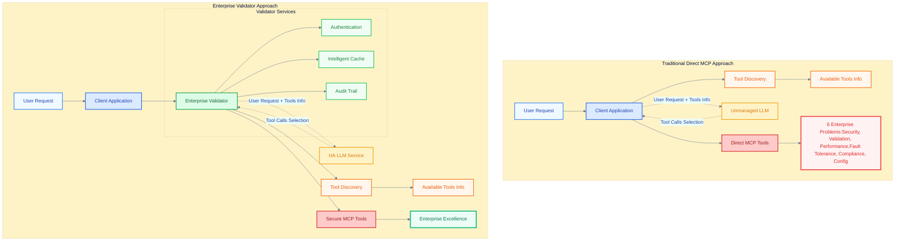

### The Single Solution to Six Problems

"This is our Enterprise Validator," Sarah explained, "an intelligent middleware layer that doesn't just solve our six problems, it transforms them into competitive advantages."

The room leaned forward as Sarah walked through the transformation:

#### How the Validator Solves Security

Instead of hoping applications won't access inappropriate tools, the Validator actively enforces access control. Every application request is authenticated, every tool call is authorized, every data access is verified against enterprise policies.

"The Validator asks: Which application is making this request? Is this application authorized to use these tools? Does this request comply with our enterprise security policies?"

#### How the Validator Solves Validation

Instead of letting invalid requests crash systems, the Validator intelligently validates and corrects requests before they reach enterprise tools.

"The Validator asks: Is this request technically valid? Are the parameters correct? Does this combination of tools make business sense?"

#### How the Validator Solves Performance

Instead of repeatedly calling expensive APIs, the Validator intelligently caches responses and recognizes when similar questions have been asked recently.

"The Validator asks: Have we seen this question before? Can we provide a faster response from our intelligent cache?"

#### How the Validator Solves Fault Tolerance

Instead of crashing when things go wrong, the Validator gracefully handles failures with retry logic, circuit breakers, and fallback strategies.

"The Validator asks: Is this service healthy? Should we retry this request? What's our backup plan if this fails?"

#### How the Validator Solves Compliance

Instead of operating in the dark, the Validator comprehensively logs every interaction, creating the audit trails that regulators require.

"The Validator asks: Who accessed what data? When did they access it? What business justification authorized this access?"

#### How the Validator Solves Service Discovery

Instead of manually configuring every client, the Validator dynamically discovers available services and manages tool routing automatically.

"The Validator asks: What tools are currently available? Which tools should this application have access to? How do we route this request efficiently?"

### The Enterprise Architecture Transformation

The CFO spoke up: "This sounds elegant in theory, but how does this actually work in practice? How do we deploy this without disrupting our existing operations?"

Sarah smiled. She had been waiting for this question.

"The beauty of the Validator pattern is that it's non-invasive. We deploy it as a middleware layer between our AI and our existing systems. No changes to your customer databases, no modifications to your market data feeds, no disruption to your core operations."

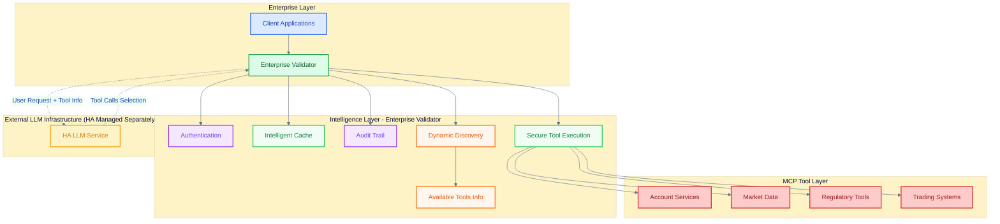

### The Architecture Crystallizes

The VP of Operations raised her hand: "What are the architectural benefits? How does this transform our enterprise systems?"

Sarah had prepared for this moment with comprehensive architectural analysis:

Architectural Efficiency:

- Intelligent caching eliminates redundant LLM API calls
- Request validation prevents cascade failures across enterprise systems
- Self-healing patterns reduce operational intervention requirements

Security Architecture:

- Comprehensive application-to-MCP access control enforcement
- Complete audit trail architecture for regulatory compliance
- Automated policy enforcement across all enterprise interactions

Operational Architecture:

- Fault tolerance patterns ensure continuous service availability
- Intelligent caching and routing optimize enterprise performance
- Dynamic service discovery eliminates configuration management overhead

"But here's the real value," Sarah continued, "the Validator doesn't just solve today's problems. It creates a platform for tomorrow's AI innovations. Every new AI capability we build automatically inherits enterprise-grade security, performance, and compliance."

### The Architectural Decision

The room was quiet as the implications sank in. This wasn't just about fixing their MCP implementation, this was about building a foundation for enterprise AI that could scale with their ambitions.

The CEO spoke for the first time: "Sarah, this feels like the right approach. But I need to understand: how do we actually implement this? What does the journey look like?"

"That's exactly what we need to explore next," Sarah replied. "The Validator concept is our destination, but the journey requires us to understand how each component works, how they integrate together, and how we build this transformation while maintaining business continuity."

The Path Forward: The Enterprise Validator had emerged as their architectural north star. But transforming this vision into reality would require diving deep into the enterprise patterns that make the Validator not just functional, but bulletproof.

The next phase of their journey would explore how to build each component of the Validator in a way that meets the demanding requirements of enterprise-scale AI integration.

---

## Part 4: Building the Enterprise Intelligence Layer

Wednesday morning. Sarah's architecture team gathered around the whiteboard, ready to transform the Validator concept into detailed enterprise architecture.

### The Validator Deep Dive: Enterprise Intelligence in Action

"Yesterday we established what the Validator does," Sarah began. "Today we design how it works in the real world of enterprise constraints, compliance requirements, and operational realities."

The team faced the classic enterprise challenge: building something that was simultaneously powerful enough to handle complex business requirements and simple enough to maintain and scale.

### The Three-Layer Enterprise Pattern

Sarah drew three horizontal layers on the whiteboard, each representing a critical aspect of enterprise AI architecture:

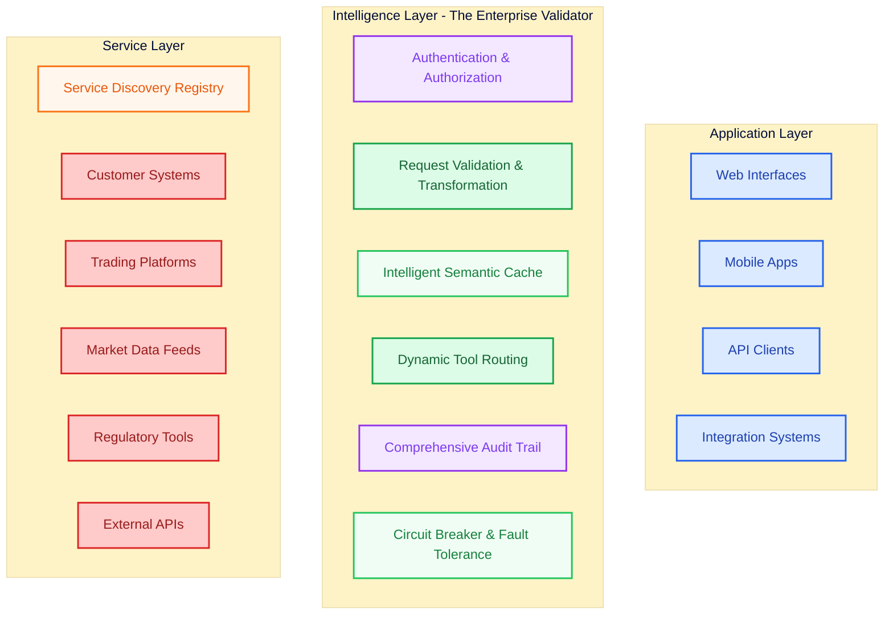

### Layer 1: Authentication & Authorization Architecture

"First layer: Who can do what, and how do we enforce it across thousands of daily interactions?"

The enterprise authentication challenge operates at two distinct architectural layers that must be clearly separated for successful implementation.

Application-to-MCP Authentication (Enterprise Validator's Domain): The Validator handles secure integration between client applications and MCP tools:

- Application Identity Management: Each client application authenticates using`client_id`,`secret`, and`app_name` credentials
- Tool-Level Authorization: Applications are granted access to specific MCP tools based on business requirements and enterprise policies
- Enterprise Policy Enforcement: Centralized policies govern which applications can access which categories of tools (customer data tools, market data feeds, regulatory systems)
- Audit Compliance: Complete logging of all application-to-MCP interactions for regulatory requirements and security monitoring

User-to-Application Authorization (Client Application's Domain): User-level authorization and response filtering remains entirely within each application's architectural boundary:

- User Role Management: Applications implement their own user authentication and role-based access control systems
- Response Filtering: Applications are responsible for filtering tool responses based on user permissions and business context
- Semantic Authorization: When users make natural language requests that might access restricted data, applications must implement appropriate validation and filtering logic according to their domain expertise
- Business Context Enforcement: Applications understand their specific requirements and implement authorization patterns that match their user experience needs

Critical Architectural Assumptions:

Application Authorization Boundary: The Enterprise Validator provides secure, performant, and compliant application-to-MCP integration. User-level authorization, including semantic filtering of tool responses based on user roles and business context, is the responsibility of each client application. This separation ensures the Validator remains focused on its core mission while allowing applications the flexibility to implement user authorization patterns that match their specific business requirements.

LLM Infrastructure Boundary: Large Language Model infrastructure is maintained as a separate, highly available service outside the Enterprise Validator architecture scope. Whether deployed on-premises, in cloud environments with private network connectivity, or in hybrid configurations, LLM high availability, performance, and fault tolerance are managed by dedicated LLM infrastructure teams. The Enterprise Validator optimizes connectivity TO LLM services and handles application-to-MCP integration, but does not manage LLM internal resilience, scaling, or availability patterns.

"The beauty is clear separation of concerns," Sarah explained. "The Validator ensures enterprise-grade application-to-MCP security and optimizes around highly available LLM infrastructure, while applications handle user authorization and LLM teams manage model infrastructure. No architectural confusion, no scope creep, no compromised security."

### LLM Deployment Architecture Patterns

"Before we dive deeper into the Validator layers, we need to understand how the Enterprise Validator integrates with different LLM infrastructure deployment patterns that enterprises commonly use," Sarah continued, turning to a new section of the whiteboard.

Enterprise LLM Deployment Scenarios:

The Enterprise Validator architecture supports three primary LLM deployment patterns, each with distinct connectivity and integration considerations:

#### Pattern 1: On-Premises LLM Infrastructure

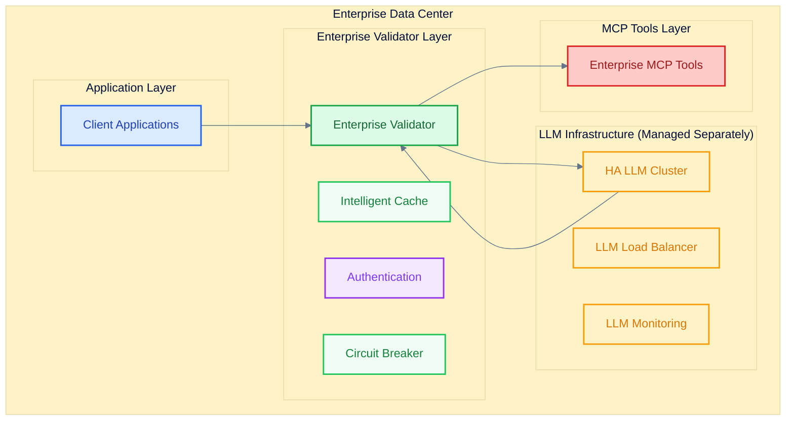

On-Premises Characteristics:

- Complete Data Sovereignty: All processing remains within enterprise infrastructure
- LLM Infrastructure Responsibility: Enterprise LLM team manages clustering, load balancing, and high availability
- Validator Integration: Optimizes requests to internal LLM endpoints with enterprise authentication
- Network Security: Internal network policies and segmentation protect LLM infrastructure

#### Pattern 2: Cloud LLM with Private Network Connectivity

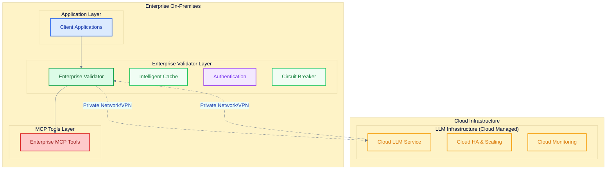

Cloud with Private Network Characteristics:

- Hybrid Architecture: Applications and tools on-premises, LLM infrastructure in cloud
- Private Connectivity: Secure VPN or dedicated network connections to cloud LLM services
- Cloud LLM Responsibility: Cloud provider manages LLM availability, scaling, and performance
- Validator Integration: Handles secure connectivity and request optimization across network boundary

#### Pattern 3: Hybrid LLM Deployment

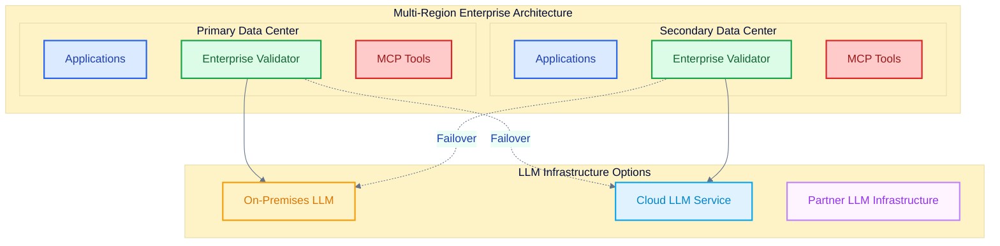

Hybrid Deployment Characteristics:

- Flexible Architecture: Multiple LLM infrastructure options for different use cases
- Intelligent Routing: Validator routes requests based on data classification, performance, and availability
- Fault Tolerance: Automatic failover between LLM infrastructure providers
- Compliance Flexibility: Route sensitive data to on-premises LLM, general queries to cloud LLM

---

## Part 5: Enterprise Service Discovery - The Foundation Layer

Thursday morning. The architecture meeting had evolved into a multi-day design session as Sarah's team worked through the practical realities of enterprise implementation.

### The Service Discovery Challenge

"Before we can build the Validator," Sarah explained to the expanded team that now included operations, security, and compliance representatives, "we need to solve the foundational problem that's preventing enterprise AI adoption: How do we manage hundreds of tools and services without drowning in configuration complexity?"

The Head of Operations nodded grimly. "Last month, adding a simple currency conversion service required 47 configuration file updates across 12 applications. The process took three weeks and introduced two production bugs. We can't scale AI with that approach."

Sarah turned to the whiteboard and drew a simple but powerful comparison:

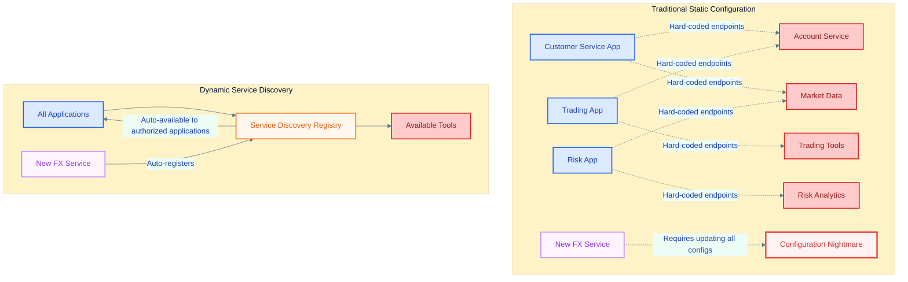

### The Enterprise Service Registry Architecture

"Instead of each application knowing about every service, we create a central registry that knows about everything, and applications discover what they need dynamically."

The Registry Components:

Service Registration Hub: New MCP tools automatically register their capabilities, endpoints, and requirements when they come online. No manual configuration needed.

Permission Mapping Engine: The registry doesn't just track what tools exist, it tracks who can use which tools based on enterprise policy and business rules.

Health Monitoring Layer: The registry continuously monitors service health, automatically routing traffic away from failing services and back when they recover.

Version Management System: As tools evolve, the registry manages multiple versions, allowing gradual rollouts and easy rollbacks.

### Dynamic Configuration Through Business Rules

The Chief Security Officer raised a critical question: "This sounds like it could create security holes. How do we ensure that automatic service discovery doesn't accidentally give people access to tools they shouldn't have?"

"Excellent question," Sarah replied. "The registry doesn't just discover services, it enforces business rules about who can discover what."

Enterprise Permission Model:

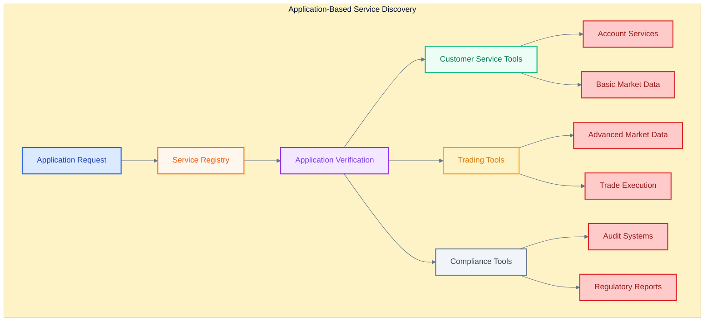

### Configuration as Code: The GitOps Integration

The DevOps lead spoke up: "How do we manage changes to these business rules? How do we ensure that permission changes go through proper approval processes?"

Sarah smiled. This was where the architecture became truly elegant.

"We treat service discovery configuration like enterprise code. All permission mappings, business rules, and access policies are stored in Git repositories with the same approval workflows we use for critical business logic."

The GitOps Service Discovery Pattern:

```mermaid

%%{init: {"theme": "base", "themeVariables": {"primaryColor": "#f0f9ff", "primaryTextColor": "#1e40af", "primaryBorderColor": "#2563eb", "lineColor": "#64748b", "secondaryColor": "#ecfdf5", "tertiaryColor": "#fef3c7"}}}%%
graph LR
    subgraph ConfigMgmt ["Configuration Management"]
        DevTeam[Development Teams] --> PR[Pull Request]
        PR --> CodeReview[Code Review]
        CodeReview --> Security[Security Approval]
        Security --> Compliance[Compliance Sign-off]
        Compliance --> Merge[Merge to Main]
    end

    subgraph AutoDeploy ["Automatic Deployment"]
        Merge --> Registry[Service Registry Update]
        Registry --> Live[Live Configuration]
        Live --> AuditTrail[Audit Trail]
    end

    classDef devLayer fill:#dbeafe,stroke:#2563eb,stroke-width:2px,color:#1e40af
    classDef gitOpsLayer fill:#ecfdf5,stroke:#10b981,stroke-width:2px,color:#047857
    classDef securityLayer fill:#f3e8ff,stroke:#9333ea,stroke-width:2px,color:#7c3aed
    classDef complianceLayer fill:#f1f5f9,stroke:#64748b,stroke-width:2px,color:#374151
    classDef registryLayer fill:#fff7ed,stroke:#f97316,stroke-width:2px,color:#ea580c
    classDef auditLayer fill:#fdf4ff,stroke:#c084fc,stroke-width:2px,color:#9333ea

    class DevTeam devLayer
    class PR,CodeReview,Merge gitOpsLayer
    class Security securityLayer
    class Compliance complianceLayer
    class Registry,Live registryLayer
    class AuditTrail auditLayer
    
```

### Intelligent Load Balancing and Failover

"Now let's address reliability. How does service discovery handle failures, capacity constraints, and geographic distribution?"

Multi-Region Service Discovery:

```mermaid

%%{init: {"theme": "base", "themeVariables": {"primaryColor": "#f0f9ff", "primaryTextColor": "#1e40af", "primaryBorderColor": "#2563eb", "lineColor": "#64748b", "secondaryColor": "#ecfdf5", "tertiaryColor": "#fef3c7"}}}%%
graph TB
    subgraph MultiRegionDiscovery ["Multi-Region Service Discovery"]
        App[Application Request] --> Registry[Global Registry]
        Registry --> HealthCheck[Health Assessment]
        HealthCheck --> USEast[US East Services]
        HealthCheck --> USWest[US West Services]
        HealthCheck --> Europe[European Services]
        HealthCheck --> Asia[Asian Services]

        USEast -.->|"Failover"| USWest
        Europe -.->|"Failover"| USEast
        Asia -.->|"Failover"| Europe
    end

    classDef appLayer fill:#dbeafe,stroke:#2563eb,stroke-width:2px,color:#1e40af
    classDef registryLayer fill:#fff7ed,stroke:#f97316,stroke-width:2px,color:#ea580c
    classDef healthLayer fill:#f0fdf4,stroke:#22c55e,stroke-width:2px,color:#15803d
    classDef regionUS fill:#e0f2fe,stroke:#0ea5e9,stroke-width:2px,color:#0284c7
    classDef regionEurope fill:#fef3c7,stroke:#f59e0b,stroke-width:2px,color:#d97706
    classDef regionAsia fill:#fdf4ff,stroke:#c084fc,stroke-width:2px,color:#9333ea

    class App appLayer
    class Registry registryLayer
    class HealthCheck healthLayer
    class USEast,USWest regionUS
    class Europe regionEurope
    class Asia regionAsia
    
```

---

## Part 6: High Availability & Enterprise Resilience

Friday morning. The week-long architectural deep-dive was nearing its conclusion, but the most critical question remained: How do we ensure this enterprise AI platform never fails?

### The Zero-Downtime Imperative

The Chief Operations Officer opened the session with a sobering reminder: "Last quarter, our trading systems experienced 14 minutes of downtime. It disrupted critical business operations and triggered regulatory inquiries. Our AI platform cannot have any tolerance for failure."

### Multi-Layer Resilience Architecture

Sarah sketched the comprehensive resilience strategy that would make their AI platform bulletproof:

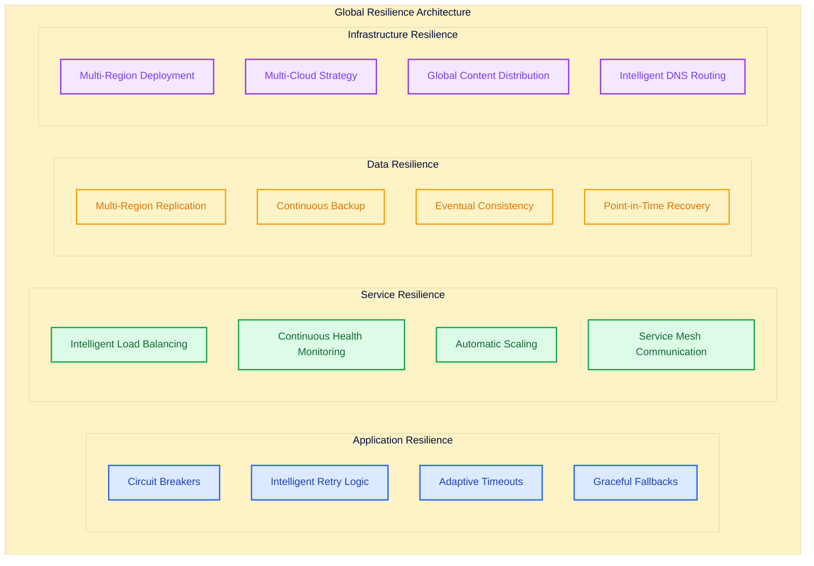

### Intelligent Caching for Resilience

Enterprise-Grade Semantic Caching:

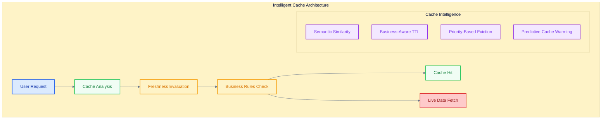

### Global Enterprise Validator Architecture

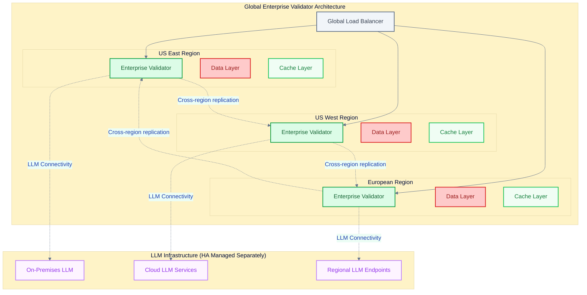

### Performance Under Extreme Load

"Let's stress-test this architecture. Market volatility events can increase our AI query volume by 50x. How does the system handle extreme load spikes?"

Adaptive Scaling Architecture:

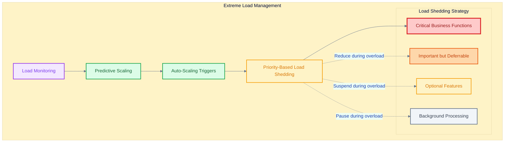

---

## Part 7: Enterprise Implementation Roadmap

Monday morning, one week after the architectural design sessions began. The conference room buzzed with anticipation as Sarah prepared to present the comprehensive implementation strategy that would transform their AI platform vision into business reality.

### Architectural Maturity Level 1: Foundation Architecture

"Level 1 objective: Establish core validator patterns and essential enterprise infrastructure."

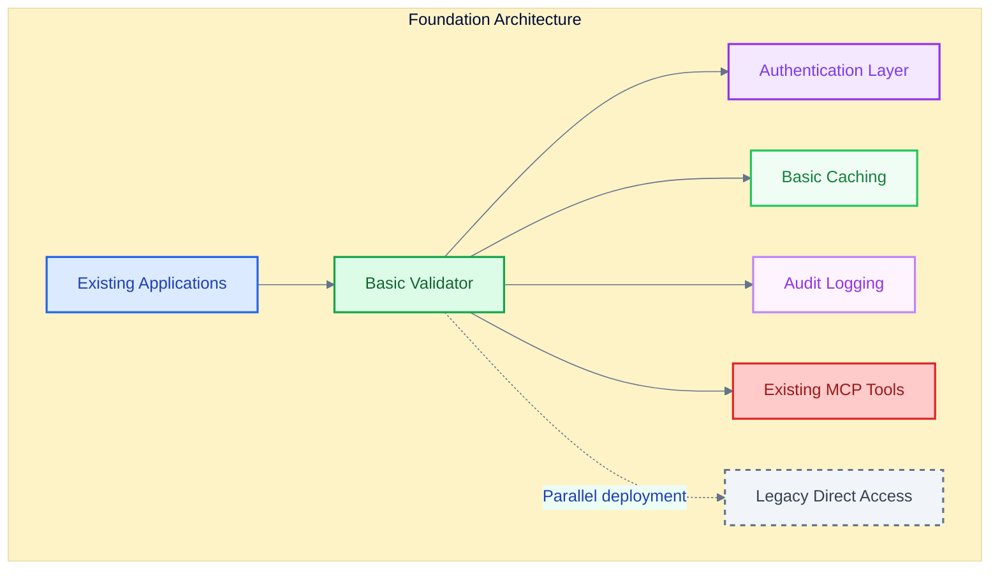

### Architectural Maturity Level 2: Security and Compliance Architecture

"Level 2 objective: Achieve enterprise-grade security architecture and comprehensive regulatory compliance patterns."

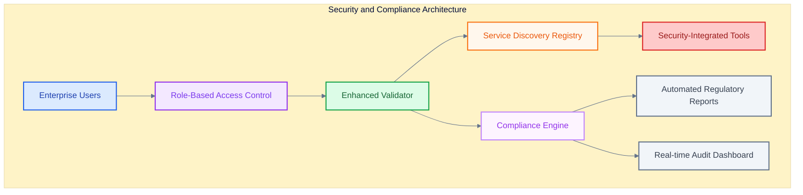

### Architectural Maturity Level 3: Performance and Scale Architecture

"Level 3 objective: Enterprise-scale performance architecture with advanced intelligent optimization patterns."

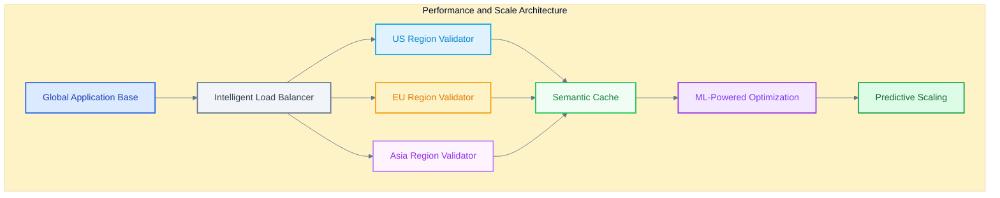

---

## Conclusion: The Complete Enterprise AI Transformation

Six months later. Sarah stands before the same boardroom where this journey began, but everything has changed.

### The Architecture That Made It Possible

The transformation wasn't achieved through revolutionary technology, it was accomplished through systematic application of enterprise architecture principles to AI integration challenges.

The Three-Layer Enterprise Pattern:

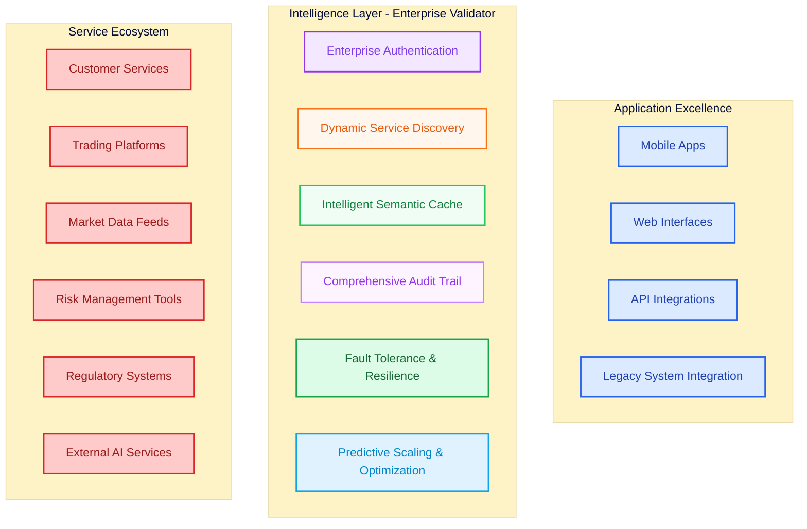

The Validator Revolution: The Enterprise Validator emerged as more than middleware, it became the central nervous system that enabled AI to operate at enterprise scale with enterprise requirements:

- Single point of security enforcement across all AI interactions
- Unified service discovery eliminating configuration management complexity
- Intelligent performance optimization reducing costs while improving user experience
- Comprehensive compliance automation satisfying regulatory requirements automatically
- Bulletproof fault tolerance ensuring business continuity under any failure scenario

### The Strategic Transformation

"But the real transformation isn't technical, it's strategic. We've moved from AI as an experimental tool to AI as essential business infrastructure."

The Business Agility Revolution:

- New AI tools can be deployed enterprise-wide in minutes instead of months
- Business process changes automatically propagate through AI interactions
- Regulatory updates are implemented once and applied consistently across all AI operations
- Performance optimization happens automatically based on usage patterns and business priorities

### The Lessons Learned

Enterprise AI Success Requires Systematic Architecture: The organizations that succeed with enterprise AI aren't those with the most advanced models, they're those with the most robust integration architecture.

Security Cannot Be an Afterthought: Every AI interaction in an enterprise context is a potential security, compliance, and business risk. Centralized security enforcement is essential, not optional.

Performance at Scale Requires Intelligence: Simple caching and optimization strategies fail at enterprise scale. Semantic understanding and business-context awareness are necessary for sustainable performance.

Configuration Management Is the Hidden Killer: The complexity of managing hundreds of AI tools across dozens of applications will overwhelm any manual configuration approach. Dynamic service discovery isn't a nice-to-have, it's survival.

Fault Tolerance Must Be Built In, Not Bolted On: Enterprise systems fail in complex ways. Resilience patterns must be embedded in the architecture from the beginning, not added during crisis recovery.

### The Future Platform

"We've built something remarkable, but this is just the beginning. The platform we've created becomes the foundation for the next generation of enterprise AI capabilities."

The Platform Economy of Enterprise AI: The Enterprise Validator architecture creates a platform where AI innovations can be rapidly integrated, tested, and deployed across the organization:

- Internal AI development teams can focus on business value instead of infrastructure
- Vendor AI solutions integrate seamlessly through standardized interfaces
- Business units can innovate with AI without technology overhead
- Compliance and security teams maintain oversight without blocking innovation

The Continuous Evolution Model: The platform automatically evolves with advancing AI technology:

- New AI models integrate transparently without application changes
- Advanced capabilities become available to existing applications automatically
- Performance improvements benefit all applications simultaneously
- Security enhancements protect all AI interactions without individual updates

### The Industry Transformation

"What we've accomplished here represents a new model for enterprise AI integration. Organizations worldwide are facing the same challenges we solved, and many are failing because they're approaching AI integration as a technology problem instead of an enterprise architecture challenge."

The Enterprise AI Maturity Model:

Level 1 - Experimental: Isolated AI pilots with custom integrations Level 2 - Functional: Multiple AI tools with basic operational support Level 3 - Integrated: Centralized AI platform with enterprise security and compliance Level 4 - Optimized: Intelligent platform with automatic optimization and scaling Level 5 - Strategic: AI platform drives business innovation and competitive advantage

GlobalBank had progressed from Level 1 to Level 4 in six months, with Level 5 capabilities coming online over the following year.

### The Call to Action

"The enterprise AI revolution is happening now. The organizations that build robust integration architecture today will dominate their industries tomorrow. The organizations that continue treating AI as isolated experiments will find themselves unable to compete with enterprises that have transformed AI into strategic business infrastructure."

The Strategic Imperative for Every Enterprise:

Build AI Architecture, Not Just AI Applications: Success requires systematic platform thinking, not tool-by-tool implementation.

Invest in Integration Excellence: The competitive advantage comes from seamless integration across business processes, not individual AI capabilities.

Prioritize Enterprise Requirements: Security, compliance, performance, and reliability are not constraints on AI, they're enablers of AI adoption at enterprise scale.

Plan for Platform Evolution: Today's AI capabilities are just the beginning. Build architecture that can evolve with advancing technology.

### The Final Question

"Six months ago, we asked whether we could build enterprise-grade AI integration. Today, the question is: How quickly can other organizations follow this path to transform their business with AI?"

The Enterprise Validator architecture, service discovery patterns, and resilience frameworks developed at GlobalBank provide a proven blueprint for any organization seeking to transform AI from experimental technology into essential business infrastructure.

The future of enterprise competition will be determined by AI integration excellence. The architecture patterns and implementation strategies demonstrated here provide the foundation for that competitive advantage.

The question for every enterprise leader is simple: Will you build the AI platform that powers your industry's future, or will you struggle to keep up with competitors who did?

The transformation starts with a single architectural decision: Choose platform thinking over point solutions, and build enterprise AI that actually works at enterprise scale.
